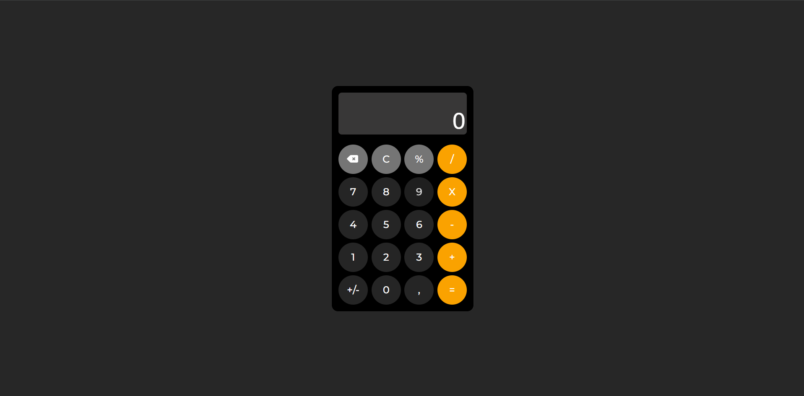

# Calculadora

Uma calculadora funcional desenvolvida com HTML, CSS e JavaScript puro, inspirada no design da calculadora do iPhone.



## Funcionalidades

- Operações básicas: soma, subtração, multiplicação e divisão
- Suporte a números decimais com vírgula
- Cálculo de porcentagem
- Inversão de sinal (+/-)
- Remoção de dígito por vez (backspace)
- Limpeza completa do display (C)

## Tecnologias utilizadas

- HTML5
- CSS3 (Flexbox e Grid)
- JavaScript (Vanilla JS)
- Font Awesome (ícones)
- Google Fonts (Montserrat)

## Como executar

1. Clone o repositório:
   ```bash
   git clone https://github.com/RicardoBertolucci/calculadora.git
   ```
2. Abra o arquivo `index.html` no navegador.

Não requer instalação de dependências ou servidor.

## Conceitos praticados

- Manipulação de DOM
- Event delegation com `addEventListener`
- `classList.contains` para identificar elementos clicados
- Gerenciamento de estado com variáveis globais
- Funções puras para cada operação matemática
- Metodologia BEM para nomenclatura de classes CSS
- CSS Grid para layout dos botões

## Melhorias futuras

- [ ] Suporte a teclado
- [ ] Histórico de operações
- [ ] Formatação de milhar no display
- [ ] Animações nos botões
- [ ] Responsividade para mobile

## Autor

Feito por [Ricardo](https://github.com/RicardoBertolucci) — parte de um roadmap de estudos rumo ao desenvolvimento fullstack com Node.js.
